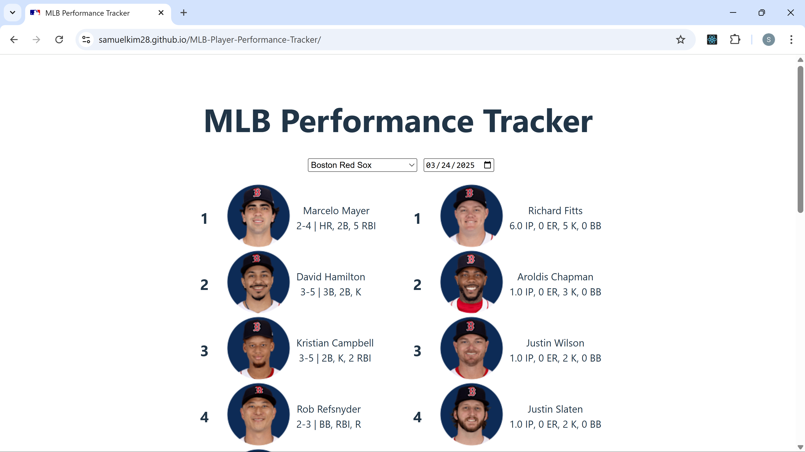

# MLB Player Performance Tracker

This web application is for MLB fans interested in keeping up with MLB player performances and stats. It uses the official MLB Stats API to display real-time data about MLB players' stats for any selected team or date of baseball game. A performance scoring system is used to rank each of the players in order, based on how well they performed in terms of their batting and pitching stats. If a selected game is currently in progress, the web application will continuously fetch data from the API to provide the most up-to-date rankings for each player.  

https://samuelkim28.github.io/MLB-Player-Performance-Tracker/

